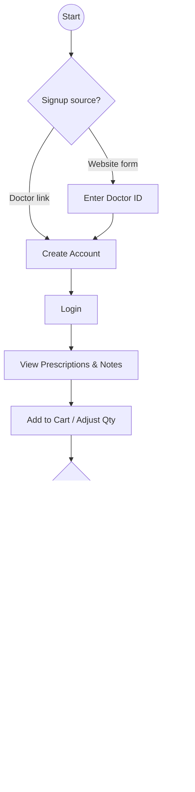

# ls-plan

# Medical Peptide Distribution Platform – Planning Document (v0.3 Draft)

---

## Product Overview (Plain‑English)

We’re building a **web platform that connects prescribing doctors with their patients for fast, compliant peptide therapy—complete with built‑in e‑commerce and automated fulfillment.**  

* **Doctors** sign up via a referral link, choose peptides from an approved catalog, add dosage notes, and send the prescription straight to their patient. Each sale earns them a commission that’s tracked automatically.
* **Patients** click the secure link, read their doctor’s instructions, and checkout using a familiar online cart. ShipStation handles packing and shipping so the peptides arrive at the patient’s door—no pharmacy trip required.
* **Admins** steer the whole operation from a single console: approving doctors, updating the product catalog, monitoring inventory, and releasing weekly commission payouts.

> In short, it’s **Shopify‑style shopping meets telehealth convenience**, purpose‑built for medical‑grade peptide distribution.

---

## 1  Project Outline (Key Components & Relationships) (Key Components & Relationships)

| Domain Area | Purpose | Primary Actors | Notes |
|-------------|---------|----------------|-------|
| **Auth & Identity** | Secure sign‑up / login, MFA, role‑based access | Doctors, Patients, Admins | Doctors register via referral link approved by Admin citeturn0file0 |
| **Doctor Portal** | Create / edit protocols, prescribe products, view commissions | Doctors | Single doctor role; optional per‑doctor pricing rules |
| **Patient Portal** | View prescriptions, add items to cart, checkout, autoship | Patients | Autoship default 30‑day cycle citeturn0file0 |
| **Product & Pricing** | Central catalog, inventory, optional price overrides | Admin | Integrates with ShipStation for fulfillment |
| **E‑commerce & Payments** | Cart, promo codes, checkout, Authorize.net | Patients | — |
| **Messaging & Notifications** | **Optional** secure doctor–patient chat, email/SMS push | All | Messaging toggle per doctor; **SMS reserved for high‑priority events** (see Notification Matrix) |
| **Commissions & Payouts** | Weekly commission calc, payment ledger | Doctors, Admin | Bank transfer / wallet |
| **Admin Console** | System config, content CMS, reports, ACL | Admin | Dashboards, inventory, events citeturn0file0 |

### Component Relationship Diagram (Mermaid)

---

## 2  User Flow Diagrams *(unchanged)*

### 2.1 Doctor Journey

### 2.2 Patient Journey

### 2.3 Admin Journey

---

## 3  Refined Scope, Priorities & Phasing

### 3.1 Feature Matrix
| Feature | MVP (Phase 1) | Phase 2 | Phase 3 |
|---------|---------------|---------|---------|
| Secure auth (MFA) | ✅ | — | — |
| Doctor registration & portal | ✅ | Enhanced dashboards | Mobile app |
| Patient portal, cart, checkout | ✅ | Autoship | Mobile app |
| Product catalog & ShipStation sync | ✅ | Stock alerts | Multi‑warehouse |
| Prescription & notes | ✅ | Bulk protocol templates | AI suggestion engine |
| Messaging center | Basic (1‑to‑1) | Ticketing w/ images | AI auto‑response |
| Commission engine | ✅ | Advanced analytics | ACH payouts integration |
| Admin console & CMS | ✅ | Content scheduling | A/B testing |

*(Advanced compliance can be scheduled once regulatory needs arise.)*

### 3.2 Timeline (indicative)
1. **Phase 0 – Discovery (2 wks):** Finalize requirements, data models.
2. **Phase 1 – MVP Build (12 wks):** Core portals, payments, fulfillment, commission.
3. **Phase 2 – Engagement (8 wks):** Autoship, messaging upgrades, advanced reports.
4. **Phase 3 – Mobile & AI (10 wks):** iOS/Android apps, AI chat assistant.

---

## 4  High‑Level System Architecture Recommendations

### 4.1 Tech Stack Alignment
* **Front‑end:** Next.js / React (TypeScript) with Tailwind CSS for rapid UI.
* **Back‑end:** NestJS (Node.js) microservices; strong typing & modularity.
* **Data:** PostgreSQL (core), Redis (sessions & queues), S3‑compatible object storage (images, docs).
* **APIs & Integrations:**
  * **ShipStation** – REST API for order sync + tracking.
  * **Authorize.net** – Accept payments, tokenize cards; webhooks for autoship renewals.
  * **Twilio SendGrid / SMS** – notifications.
* **Security:**
  * HTTPS‑only, AES‑256 at rest, TLS 1.3 in transit.
  * Audit logging, signed URL file access.
* **Infra & DevOps:**
  * Docker‑compose locally; Kubernetes (EKS / GKE) in prod.
  * GitHub Actions CI/CD → Terraform IaC.
  * Sentry & Datadog for monitoring.
* **Scalability Pattern:** API‑gateway → service mesh → microservices; pub/sub (NATS) for async tasks (commissions, autoship).

### 4.2 Key Architectural Considerations
* **Multi‑tenant DB design** to isolate doctor data while sharing schema.
* **Event sourcing** for orders & commissions – enables audit trails and rollback.
* **Event‑driven jobs vs cron** – commissions & autoship run via durable event bus + worker queue instead of fragile cron, with idempotent consumers.
* **API versioning** – expose endpoints under `/api/v1/...` from day one to protect clients from breaking changes.
* **Feature flag service** (LaunchDarkly) to roll out autoship & AI gradually.
* **Feature flag service** (LaunchDarkly) to roll out autoship & AI gradually.
* **Zero‑trust security**: short‑lived JWTs, device fingerprinting, FIDO2 for admins.
* **Testing strategy:** 90%+ unit coverage (Jest), e2e Cypress, contract tests with Pact.

---

## 5  Screen‑by‑Screen UI Description (Visual‑First Spec)

### UI Layout Conventions
* **Navigation:** Persistent left side‑nav (desktop) with collapsible sections; top bar for search, notifications, user menu.
* **Design system:** Tailwind CSS + HeadlessUI; 8‑pt spacing grid; light & dark theme; responsive breakpoints (xs, sm, md, lg, xl).
* **Mobile‑first:** Core layout and interactions designed for small screens (≥ 360 px); desktop enrichments applied progressively.
* **Loading & Empty States:** Tailwind skeleton loaders during fetches; delightful empty‑state illustrations & CTAs when lists are empty.
* **Style guide:** Single Figma token sheet (colors, type scale, spacing) keeps design/dev in sync.
* **Components:** Card, DataTable, Stepper, Drawer, Toast, Modal.

---

### 5.1 Doctor Portal Screens

| Screen | Purpose | Key Elements | Primary Actions |
|--------|---------|-------------|-----------------|
| **Dashboard** | Snapshot of practice & earnings | KPI cards (Active Patients, Open Prescriptions, Commissions YTD), Recent Activity list, Income chart (weekly) | Quick‑create prescription, View reports |
| **Patient Directory** | Manage assigned patients | Search & filters, table (Name, Last Rx, Last Order, Chat), bulk invite | View patient card, Start prescription, Message |
| **Prescription Builder** | Build & save product protocol | Multi‑step wizard (Select Patient → Select Products → Dosage & Qty → Notes → Review), real‑time cart summary sidebar | Save draft, Publish to patient, Duplicate protocol |
| **Commissions** | Track income & payouts | Line/area chart, payout ledger table, CSV export | Filter by date, Generate report |
| **Messages** | Secure chat with patients & support | Thread list, rich‑text input, file attach (future phase) | Send message, Search threads |
| **Profile & Settings** | Manage account, payout info, and communication prefs | Personal details form, bank details, password, MFA toggle, **Messaging on/off switch** | Update profile, Enable MFA, Toggle messaging |

---

### 5.2 Patient Portal Screens

| Screen | Purpose | Key Elements | Primary Actions |
|--------|---------|-------------|-----------------|
| **Dashboard** | Overview of health orders | Cards (Active Prescriptions, Next Autoship, Last Order), timeline feed, CTA banners | Add prescribed items to cart |
| **Prescription Detail** | Review doctor protocol | List of products with dosage & notes, Add‑to‑cart toggles, collapsible notes | Adjust qty, Add all to cart |
| **Catalog / Storefront** | Browse full product range | Category sidebar, product grid cards, sort & filter | View product, Add to cart |
| **Cart & Checkout** | Purchase flow | Item table, shipping address drawer, payment accordion, autoship checkbox | Apply promo, Pay now |
| **Order History** | Past & upcoming orders | Table with status chips, detail drawer per order | Re‑order, Track shipment |
| **Messages** | Chat with doctor or support *(visible only if doctor enables messaging)* | Thread list, chat view, unread badge | Reply, Upload photo (later) |
| **Account** | Personal & security settings | Profile info, addresses, payment methods, password reset | Update, Add method |

---

### 5.3 Admin Console Screens

| Screen | Purpose | Key Elements | Primary Actions |
|--------|---------|-------------|-----------------|
| **Dashboard** | System pulse | Tiles (Total Doctors, Patients, Orders, Revenue), bar chart (sales by month), table (Open Tickets) | Drill‑down links |
| **User Management** | Approve & manage users | Tabbed tables (Doctors, Patients), status filters, bulk actions | Approve, Suspend, Impersonate |
| **Catalog & Inventory** | Maintain product data | Category tree, product list with inline edit, stock level indicator, ShipStation sync status badge | Add product, Bulk import, Adjust stock |
| **Orders & Fulfillment** | Oversight of order lifecycle | Master order grid, status filter chips, detail side‑panel, tracking link | Change status, Resend confirmation |
| **Commissions & Payouts** | Calculate & release payments | Week selector, payout batch table, manual adjustment modal | Approve batch, Export ACH file |
| **Content & CMS** | Manage site content | WYSIWYG pages, news/events manager, banner scheduler | Publish, Schedule |
| **Settings** | System‑wide configs | Pricing overrides table, feature flags toggle list, email template editor | Save changes, Rollback |
| **Reports & Analytics** | Deep insights | Prebuilt dashboards (Sales, Retention, Inventory Aging), CSV export | Filter, Export |

---

---

## 5.4 Notification & SMS Event Matrix

| Audience | Event | Email | SMS | Notes |
|----------|-------|-------|-----|-------|
| Patient | Account created / password set | ✅ | — | Email contains onboarding link |
| Patient | Prescription received | ✅ | — | In‑app alert + email suffice |
| Patient | **Order shipped** | ✅ | ✅ | SMS: tracking link (high‑value) |
| Patient | **Autoship renews tomorrow** | ✅ | ✅ | Reminder 24 h prior; SMS only if autoship enabled |
| Patient | Payment failed | ✅ | ✅ | Critical; call‑to‑action to update card |
| Doctor | Patient placed order from my prescription | ✅ | — | Digest email; SMS optional toggle |
| Doctor | **Weekly commission payout released** | ✅ | ✅ | Short SMS: "Payout $123.45 sent" |
| Doctor | Support ticket from assigned patient | ✅ | — | Email; SMS optional via settings |

> **SMS Budget Guardrails:** Cap sends to ≤ 4 per patient / month and ≤ 6 per doctor / month. Track usage in Admin > Settings.

---

## 6  Next Steps
1. Validate screen descriptions with designers & stakeholders.
2. Produce wireframes (Figma) using above spec.
3. Update component library tokens (colors, typography) to match branding.
4. Align API contract requirements for each screen (data shapes, loading states).

---

*This document is living—let me know what else you’d like refined or expanded.*

